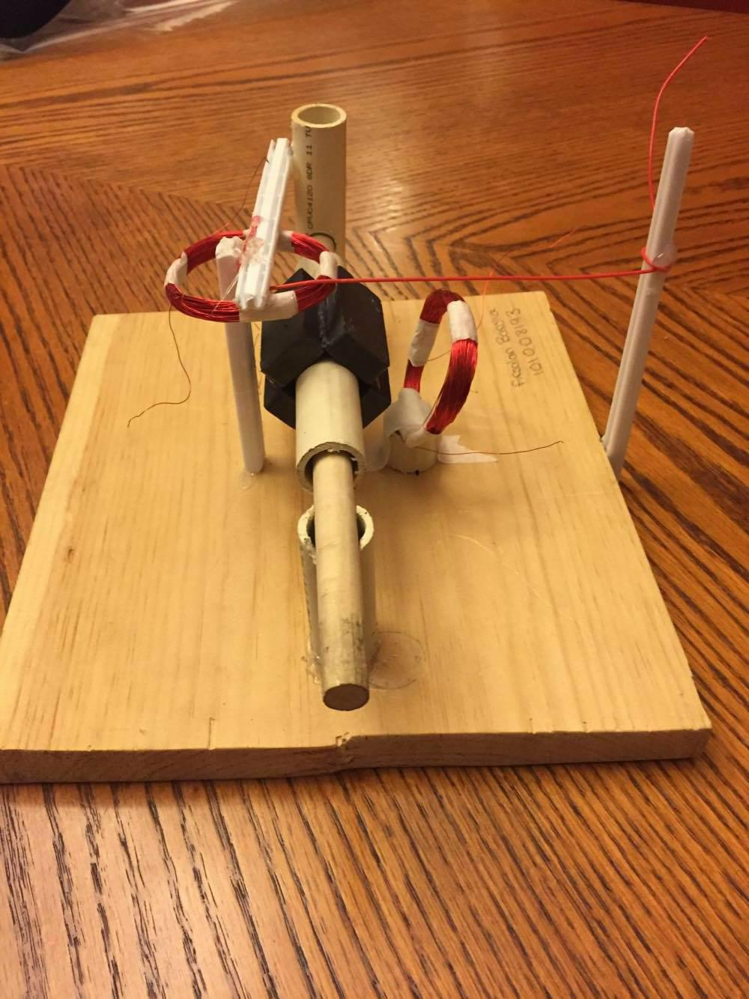
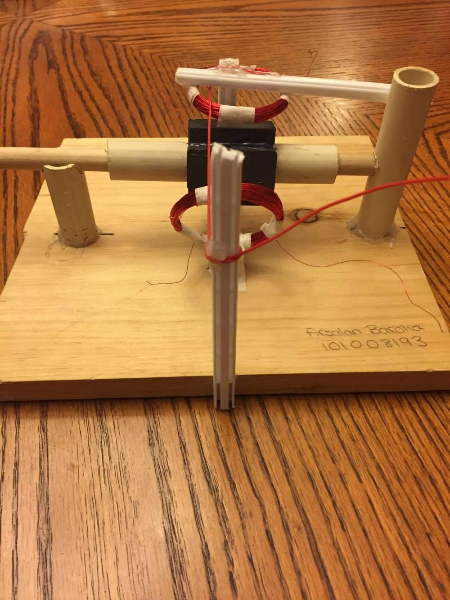
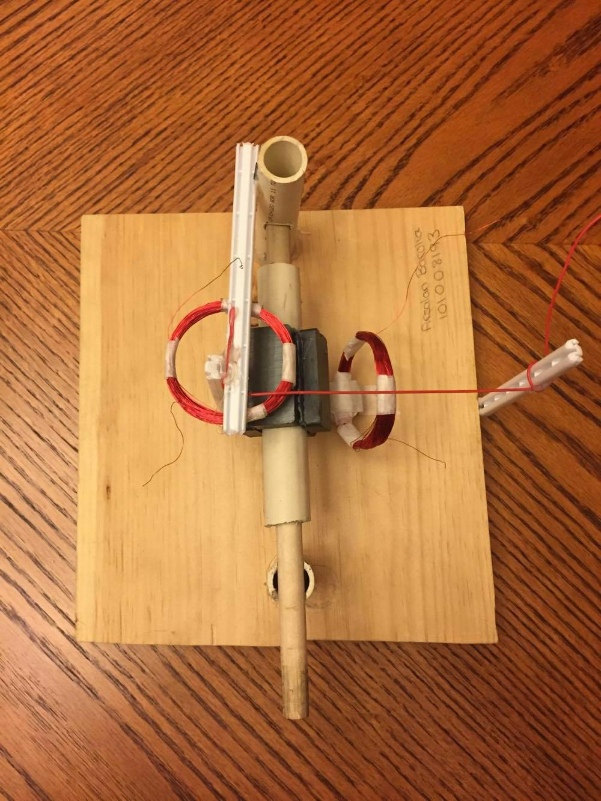

# Two-Phase AC Generator

Spun magnets near coils to cause a change in flux to enable the LED to light up by the electric field that is simultaneously being generated.

---

## Two-Phase Generator Front View

---

## Two-Phase Generator Side View

---

## Two-Phase Generator Top View

